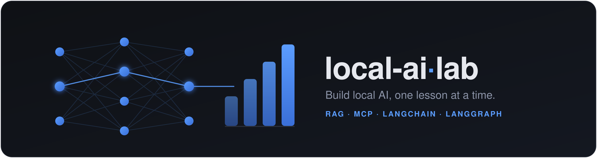

# local-ai-lab



[](https://github.com/nikolareljin/local-ai-lab/actions/workflows/ci.yml)
[](./LICENSE)
[](https://nikolareljin.github.io/local-ai-lab/)
[](./INSTALL.md)


[](https://github.com/nikolareljin/local-ai-lab/stargazers)

**A hands-on course for building local, private AI from scratch** — RAG, MCP, LangChain, and
LangGraph that run on your own machine. Each lesson builds a small, fully working, *readable*
program, so you finish understanding how the thing actually works — not just how to call an SDK.

**📖 Full documentation:** https://nikolareljin.github.io/local-ai-lab/documentation.html
· **Course site:** https://nikolareljin.github.io/local-ai-lab/
· **Author:** [Nik Reljin](https://www.linkedin.com/in/nikolareljin)

> ### ⭐ Star this repo
> If local-ai-lab is helping you build local AI, **[give it a star](https://github.com/nikolareljin/local-ai-lab)** —
> it helps other developers find the course and motivates new lessons. **[⭐ Star on GitHub →](https://github.com/nikolareljin/local-ai-lab)**

> **No Docker.** Everything runs with the language toolchains directly. The course is **polyglot** —
> **Python** is the reference, with **Node.js** and **C#** ports per lesson
> (`./run -l <N> --lang node|csharp`). **Lessons 1–5 ship in all three.**

---

## Quickstart

Needs **Python 3.10+** (add **Node.js 18+** / **.NET 8 SDK** only for those ports).

```bash
python -m venv venv && source venv/bin/activate    # Windows: venv\Scripts\Activate.ps1
pip install -r requirements.txt

./run -l 1                     # launch the RAG web UI (the default AI is Claude Code — no API key)
./run -l 1 ask "How do I reset the device?"   # one-shot grounded answer in the terminal
./run -l 5                     # jump to the latest lesson's interactive playground
```

`./run` creates the virtualenv on first use. On Windows, run `./run` from **Git Bash** or **WSL**, or
call the toolchains directly — see the
**[full documentation](https://nikolareljin.github.io/local-ai-lab/documentation.html)** for install,
run, test, experiment, and how-it-works details (Linux · macOS · Windows). Per-OS setup and optional
providers (Ollama, Gemini, OpenAI) are in **[INSTALL.md](./INSTALL.md)**
([PDF](https://nikolareljin.github.io/local-ai-lab/pdf/INSTALL.pdf)).

---

## Curriculum

Each available lesson is a deep-linkable **interactive slideshow** on the course site and a **written
guide**, and runs **100% locally**. **Lessons 1–5 are live and runnable**; the rest are on the roadmap.

| # | Lesson | What you build | Guide | Live | Status |
|---|--------|----------------|-------|------|--------|
| 1 | **RAG from scratch** | Extract → chunk → retrieve (BM25 + embeddings) → grounded answer with citations | [LESSON1.md](./LESSON1.md) | [open](https://nikolareljin.github.io/local-ai-lab/lesson-1-rag.html) | ✅ Available |
| 2 | **MCP servers** | Expose your document search as a Model Context Protocol tool Claude Code can call natively | [LESSON2.md](./LESSON2.md) | [open](https://nikolareljin.github.io/local-ai-lab/lesson-2-mcp.html) | ✅ Available |
| 3 | **Hybrid retrieval & reranking** | BM25 + a semantic arm fused with Reciprocal Rank Fusion | [README](./lessons/03-hybrid-retrieval-reranking/README.md) | [open](https://nikolareljin.github.io/local-ai-lab/lesson-3-hybrid-retrieval-reranking.html) | ✅ Available |
| 4 | **RAG safety & prompt injection** | Treat retrieved documents as untrusted input — defend against prompt injection and poisoned content | [README](./lessons/04-rag-safety-prompt-injection/README.md) | [open](https://nikolareljin.github.io/local-ai-lab/lesson-4-rag-safety-prompt-injection.html) | ✅ Available |
| 5 | **RAG evaluation & regression testing** | Golden questions, groundedness scoring, and regression tests — turn "seems good" into a tracked number | [README](./lessons/05-rag-evaluation-regression-testing/README.md) | [open](https://nikolareljin.github.io/local-ai-lab/lesson-5-rag-evaluation-regression-testing.html) | ✅ Available |
| 6 | **Repo-aware AI assistant** | Ground an assistant in your codebase so it answers with repo-specific context | — | — | Planned |
| 7 | **LangChain** | Rebuild the RAG pipeline with LangChain and compare the trade-offs | — | — | Planned |
| 8 | **LangGraph** | Turn the pipeline into a stateful agent graph with retries, tool routing, and memory | — | — | Planned |
| 9 | **Ollama + Function Calling** | Give a local model real tools it can call (function calling) — 100% offline | — | — | Planned |
| 10 | **Microsoft Semantic Kernel** | Rebuild the agent in **C# / .NET** with SK plugins and auto function calling | — | — | Planned |
| 11 | **AWS Bedrock Agents** | Knowledge bases + action groups on a managed cloud agent, driven from your machine | — | — | Planned |
| 12 | **Google AI Development Kit** | Build and run a Gemini agent locally with Google's open-source ADK | — | — | Planned |
| 13 | **AI-assisted testing** | Generate, run, and review tests, and let failures guide the fix | — | — | Planned |
| 14 | **AI code review & issue detection** | Use AI to catch the serious issues in review — real bugs, security, risky changes | — | — | Planned |
| 15 | **Documentation from sprint changes** | Generate release notes and docs straight from a sprint's commits and pull requests | — | — | Planned |

**Browse all lessons live:** https://nikolareljin.github.io/local-ai-lab/ ·
**Every lesson as a printable PDF:** [`docs/pdf/`](./docs/pdf/) — e.g.
[LESSON1.pdf](https://nikolareljin.github.io/local-ai-lab/pdf/LESSON1.pdf),
[INSTALL.pdf](https://nikolareljin.github.io/local-ai-lab/pdf/INSTALL.pdf).

---

## Documentation

- **[📖 Documentation](https://nikolareljin.github.io/local-ai-lab/documentation.html)** — install, run,
  test, experiment, and how everything works (Linux · macOS · Windows).
- **[INSTALL.md](./INSTALL.md)** ([PDF](https://nikolareljin.github.io/local-ai-lab/pdf/INSTALL.pdf)) —
  per-OS prerequisites and optional providers.
- **[Troubleshooting](https://nikolareljin.github.io/local-ai-lab/troubleshooting.html)** — provider /
  API-key setup and common errors.
- **[ARCHITECTURE.md](./ARCHITECTURE.md)** — data flow and module map.

```bash
./run list                 # every lesson and its actions
./run -l <N> demo          # one-shot, print-and-exit run (lessons 3–5; --lang node|csharp for the ports)
./run -l <N> test          # the lesson's offline test (no network, no model)
./run -h                   # full help
```

---

## License

MIT © Nik Reljin — see [LICENSE](./LICENSE). Educational use encouraged; attribution appreciated.

---

## Clone traffic


_Updated daily. Total and unique cloners over the last 14 days._
